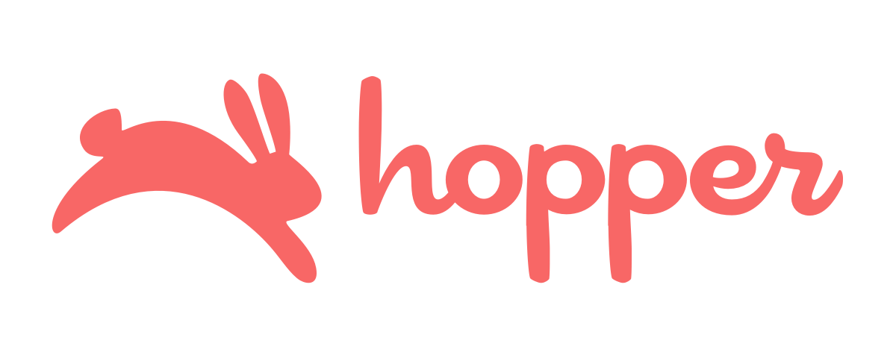
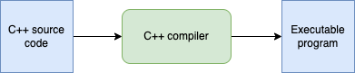
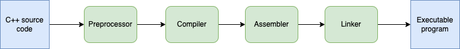

# Седмица 1


## Кой съм аз

Димитър Милев, milev.1996@gmail.com



---

## Какво да очаквате от курса

Теми, които ще покрием:

* типове и функции
* оператори, масиви и низове
* матрици и вложени цикли
* алгоритми
* функции
* указатели
* рекурсия
* backtracking
* структури
* работа с heap-a и динамична памет
* сложност
* текстови и бинарни файлове

Програмите, които ще пишем в началото:
```c++
int main() {
    return 0;
}
```

Програмите, които ще пишем в края на курса:
```c++
#include <iostream>
#include <fstream>
#include <string>

using namespace std;

struct Student {
    string name;
    double grade;

    Student() {}
    Student(string name, double grade): name(name), grade(grade) {}
};

struct Group {
    Student* students;
    int numberOfStudents;

    Group(Student* students, int numberOfStudents): students(students), numberOfStudents(numberOfStudents) {}
    
    ~Group() {
        delete[] students;
    }
};

Group readGroup(string inputFile) {
    ifstream fileStream(inputFile);
    
    int numberOfStudents;
    fileStream >> numberOfStudents;
    
    Student* students = new Student[numberOfStudents];

    double grade;
    string name;
    int index = 0;


    while(fileStream >> grade && getline(fileStream, name)) {
        Student student = Student(name, grade);
        students[index] = student;
        index++;
    }

    fileStream.close();

    return Group(students, numberOfStudents);
}

void outputPassingStudents(string outputFile, Group group) {
    ofstream fileStream(outputFile);

    for(int i = 0; i < group.numberOfStudents; i++) {
        if(group.students[i].grade >= 3) {
            fileStream << group.students[i].name << endl;
        }
    }
    
    fileStream.close();

    return;
}

int main() {
    Group g3 = readGroup("g3.txt");
    outputPassingStudents("g3-winners.txt", g3);
    return 0;
}
```

Полезни ресурси:

* Programming: Principles and Practice Using C++
* C++ Primer
* Effective C++

---

## Какво е програмирането

Програмирането е дейността по писане на програми. Програмата е набор от инструкции, с които казваме на компютъра какво да прави.

<br/>



<br/>

<br/>



<br/>


Среда за разработка(IDE)

* [Visual Studio](https://learn.microsoft.com/en-us/cpp/build/vscpp-step-0-installation?source=recommendations&view=msvc-170)
* [CodeBlocks](https://www.geeksforgeeks.org/how-to-install-code-blocks-for-c-on-windows/)
* [Visual Studio Code](https://code.visualstudio.com/docs/cpp/config-mingw)
* Текстов редактор и компилиране "на ръка" през терминала